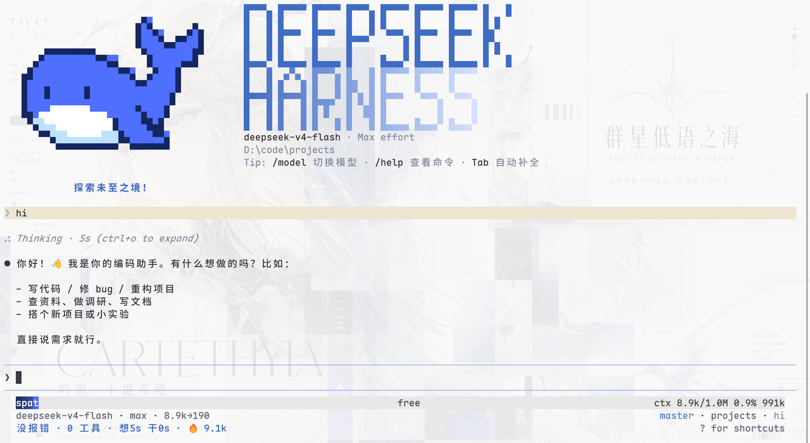
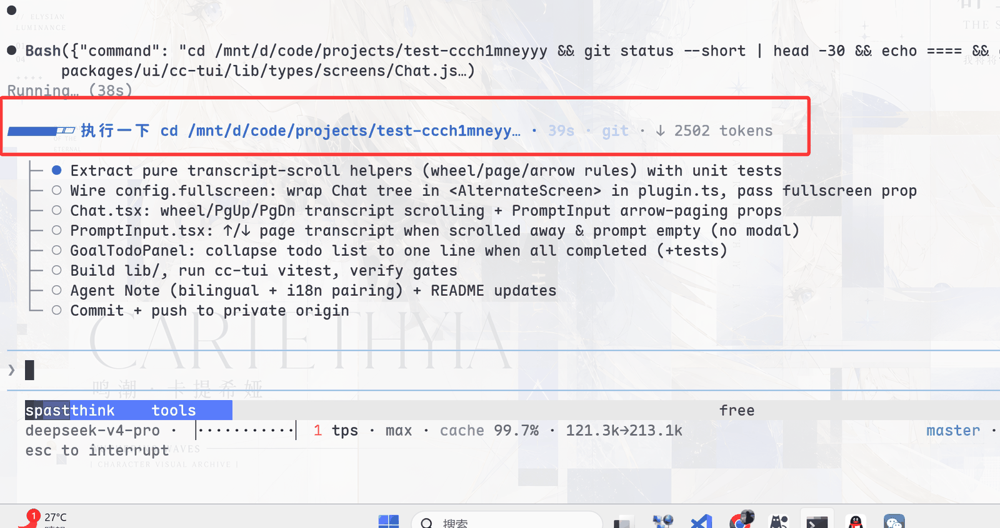
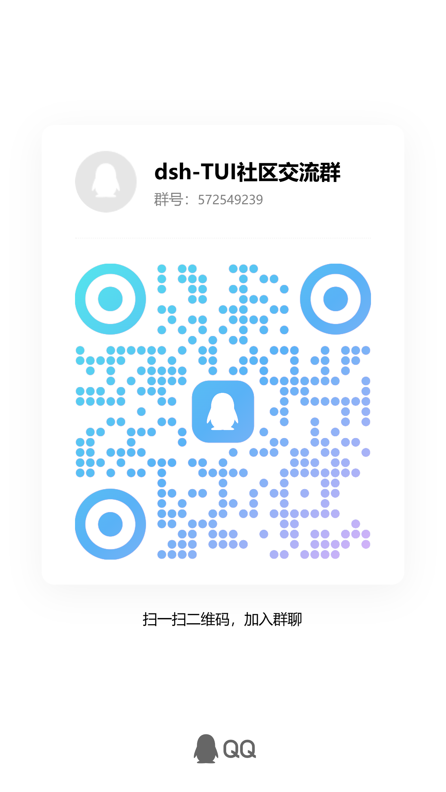

<p align="center">
  
</p>

<p align="center">
  <a href="README.md">简体中文</a> · <strong>English</strong>
</p>

<p align="center">
  <a href="https://www.npmjs.com/package/@deepseek-harness-tui/dsh-tui"></a>
  <a href="https://github.com/ccch1mneyyy/dsh-TUI/actions/workflows/ci.yml"></a>
  <a href="LICENSE"></a>
  
  <a href="https://github.com/ccch1mneyyy/dsh-TUI/stargazers"></a>
  <a href="https://www.npmjs.com/package/@deepseek-harness-tui/dsh-tui"></a>
</p>

<p align="center">
  <a href="https://trendshift.io/repositories/146168" title="GitHub Trending Daily #7 · TypeScript"></a>
</p>

# dsh-TUI

`dsh-TUI` is an interactive terminal front door for DeepSeek Harness. It is
mounted as a Cordis plugin and provides a Claude Code-style conversation, tool,
session, and fullscreen terminal experience while continuing to use the
official DSH agent, model, tool, session, and persistence services.

The project does not patch DeepSeek Harness core. Installing the plugin enables
the interface, and removing it leaves no core modifications behind.

> Status: public beta. It is suitable for daily use and extension work. Read
> [Architecture and limitations](docs/architecture.en.md) before relying on its
> permission model or terminal-specific behavior.

<p align="center">
  <a href="https://dshfind.com/en/plugins/ccch1mneyyy/dsh-TUI"></a>
</p>

## Highlights

- **Terminal-native interaction**: streaming Markdown, structured tool cards
  (terminal-card multi-line command headers fold to the first line plus a
  count via `/settings`; Ctrl+O or a card click expands), command and file completion, `@` file references (complete anywhere; text
  files attach content, directories attach listings, and PNG/JPEG/WebP/GIF are
  sent as durable image blocks; `@path#L12-14` line ranges attach only the
  requested lines, clamping past-EOF ranges or falling back to the whole file
  with a note), history
  search, message selection, inline or alternate-screen rendering, and `/lang`
  zh/en UI language switching.
- **Timeline navigation**: a Grok-style turn rail covering **every turn
  (folded ones included)** — even when the fold window only exposes the last
  few turns, the full history stays one click away (clicking a folded tick
  reveals that turn and scrolls to it). When not pinned to the bottom,
  `Enter`/`End` jump back in one step (no blank flash from long distances)
  and a clickable new-messages pill stays in view; the right gutter offers
  timeline / scrollbar / hidden modes.
- **Visible agent state**: live activity, segmented context usage, TPS, cache
  hit rate, reasoning effort, input/output tokens, and Git/session metadata.
- **Complete session workflow**: `/resume`, `/new`, `/workspace`, `/compact`, `/export`, the
  `/btw` side question, model switching, and double-`Esc` rewind through a
  session fork.
- **Official DSH integrations**: agent presets, skills, MCP, goals, todos,
  subagents, and `ask_user_question` are connected through existing services
  and registries.
- **Designed for long sessions**: event-driven projection, differential output,
  message virtualization, replay coalescing, and bounded caches prevent render
  cost and memory from growing without limit; fingerprint-memoized hot paths
  render with **zero per-frame allocations** (~200KB of GC churn saved every
  16ms tick in a 3200-row session), wrapText and markdown tokens reuse global
  LRU caches across mounts, the main screen paints in frames (fold window
  300→120 rows), and long-session resume lands straight on content (splash
  skipped, anchored to the newest message's last row).

## Preview

<p align="center">
  
</p>

Live activity, goal/todo state, and context metrics:

<p align="center">
  
</p>

## Quick Start

Prerequisites: an interactive terminal TTY, the official `dsh` CLI, and
`pnpm` 10+. Model requests also require `DEEPSEEK_API_KEY`.

```sh
# 1. Install the CLI and this plugin globally (ships the dsh-tui command)
npm install -g @deepseek-ai/dsh @deepseek-harness-tui/dsh-tui

# 2. Start it (first run auto-initializes the dsh-tui profile; needs pnpm)
dsh-tui
# Both `dsh-tui` and the short `dst` alias start the same TUI.
dst
```

Manual alternative: `dsh plugin --profile dsh-tui add @deepseek-harness-tui/dsh-tui`
(the repository's `sh install.sh` wraps this step and checks the required
commands), then `dsh-tui` (or `dst`) and `dsh --profile dsh-tui` are equivalent.

> **New-user note**: if `dsh plugin` fails with `ERR_PNPM_IGNORED_BUILDS`
> (pnpm ≥11 blocks dependencies that carry install scripts by default, e.g.
> `@google/genai` and `protobufjs` — none of these scripts is needed at
> runtime, so they can safely be ignored), add to the profile's
> `pnpm-workspace.yaml`:
>
> ```yaml
> allowBuilds:
>   '@google/genai': false
>   protobufjs: false
> ```
>
> `/update` and `dsh-tui update` seed this configuration automatically —
> no manual step needed.

`dsh-tui` (or its `dst` alias) with `--resume` restores the most recently selected session; on Windows
the repository's `dsh-tui.cmd` works the same way.

CLI subcommands (`dsh-tui help` or `dst help` prints the full usage; the `dst` alias accepts the same commands):

| Command | Purpose |
|---|---|
| `dsh-tui update` | Update the profile to the latest release and align the launcher (same install logic as the in-TUI `/update`, without restarting into the TUI) |
| `dsh-tui doctor` | Pre-flight environment checks: dsh/pnpm, profile install and version alignment, whether the API key is set (state only, never the value), config file presence; complements the in-TUI `/doctor` session diagnostics |
| `dsh-tui version` | Show the launcher and profile versions (`--version`/`-v` are equivalent) |
| `dsh-tui help` | Show usage (`--help`/`-h` are equivalent) |

`help`/`version` work even when dsh is missing or the profile is not initialized; `update` needs dsh (a missing dsh gets an install hint);
every other argument is still forwarded verbatim to `dsh --profile dsh-tui`.
The repository-root `dsh-tui.cmd` is a launch wrapper that goes straight to
`dsh --profile` and carries no subcommands — subcommands belong to the
npm-installed `dsh-tui` command.

### Herdr

Run `dsh-tui` directly in a [Herdr](https://herdr.dev) pane; no extra setup is
required. dsh-TUI reports `idle`, `working`, and `blocked` through Herdr's local
integration API and marks questionnaires and tool approvals as `blocked`. The
integration is completely inactive outside Herdr. `herdr agent start --kind
dsh-tui`, session identity, and automatic restoration after a Herdr server
restart still require a native dsh-TUI agent kind upstream; manually launched
panes already retain, reconnect, and expose their live state.

For running dsh-TUI inside VS Code — directly in the integrated terminal or
via the `dsh-tui-vscode` companion extension (real-integrated-terminal
sessions, an experience almost identical to the official Claude Code
extension; available on the VS Code Marketplace) — see
[Running dsh-TUI in VS Code](docs/vscode.en.md).

See [Getting started](docs/getting-started.en.md) for profile composition,
source builds, and troubleshooting.

The TUI checks the configured registry for newer versions in the background
after startup (the check never blocks the first frame and silently ignores
offline or registry errors). When an update is available, just type `/update`
for a one-shot upgrade: it updates the runtime actually running in the current
`dsh-tui` profile, verifies the install result, then restarts automatically and
resumes the current session.

When launched through the global `dsh-tui` command, newer versions
automatically migrate/align the global entry to a delegating launcher: the
global command only forwards to the copy inside the profile, so the startup
logic always follows the profile version.

Under normal circumstances no extra manual step is needed:

```sh
npm install -g @deepseek-harness-tui/dsh-tui
```

For migration from the former `dsh-cc-tui` package and `cc-tui` profile, see
[Getting started](docs/getting-started.en.md#migrate-from-the-former-package).

## Keybindings

| Key | Action |
|---|---|
| `Enter` | Idle = send (`Shift+Enter` for a newline, or `Ctrl+J` when the terminal cannot report modified Enter; `Option+Enter` is the fallback on macOS Terminal.app, issue #110); **while the model is working = steer** (inject a next-step boundary without interrupting); executes the selected item when a command menu is open |
| `Ctrl+Enter` (⌘Enter) | **Interrupt the current turn and send immediately** (interrupt) |
| `Alt+Up` | Pull the last unhandled message back into the input for editing (without interrupting the turn) |
| `Tab` | Complete `/` commands or `@` files (keep drilling into directories); **while the model is working = follow-up** (queued after the current turn) |
| `Ctrl+C` | Interrupt the current turn; press again while the interrupt is still settling to force-exit; press twice while idle to exit |
| `Esc` | Close the command/file menu; double-press while idle clears the input; **double-press on empty input = time rewind** |
| `Ctrl+O` | Expand/collapse details (full thinking text, tool arguments and output) |
| `Ctrl+R` | History search |
| `/` | In-session full-text search (`n`/`N` to jump) |
| `Ctrl+V` / `Alt+V` | Paste text or files from the file manager; images show as `[Image #N]` and are sent as durable attachments. Use `Alt+V` when the terminal intercepts `Ctrl+V` |
| `Ctrl+G` | Edit the current input with `$VISUAL`/`$EDITOR` (e.g. nvim); content is filled back in on save and exit |
| `?` | Keybinding menu (responds only when the input is empty) |
| `Shift+↑` | Message selection mode (`Enter` expands a single message) |
| `Ctrl+P` | Toggle the startup loaded-context panel (effective while the panel is on screen) |
| `Home` / `End`, `Ctrl+A` / `Ctrl+E` | Logical line start / end; `Ctrl+E` is dual-purpose: line end in the input, expand/collapse hidden older messages during transcription |
| `Ctrl+←` / `Ctrl+→` (⌘←/→) | Jump by word |
| `Ctrl+U` / `Ctrl+K` | Delete before the cursor (to line start) / after the cursor (to line end) |
| `Ctrl+W` | Delete the previous word |

**Three delivery modes while the model is working**: `Enter` = steer (inject a next-step boundary, no interruption) · `Tab` = follow-up (queued after the current turn) · `Ctrl+Enter` = interrupt (break in and send immediately).

**Custom keybindings**: the action shortcuts above (paste, history search, external editor, transcript expand, trajectory, subagent dashboard, loaded-context panel, show-all, redraw, todo fold) are remappable in `/settings` → `dsh-tui` → `Shortcuts`: enter combos like `alt+v` or `ctrl+shift+v`, comma-separate several, leave blank to restore the default; saves apply live with no restart. Combos that clash with the fixed editing keys (`Ctrl+A/E/U/K/W`, `Ctrl+←/→`) or with another action are rejected. Deployments can also pin them statically via `shortcuts.<action>` in cordis.yml (the settings user layer wins).

**macOS modifier keys**: the `Ctrl+<key>` bindings above also work with `⌘<key>`
on macOS (e.g. `⌘V` paste, `⌘O` expand details, `⌘Enter` send immediately);
only `Ctrl+C` / `Ctrl+D` (interrupt/exit) stay on Ctrl, to avoid clashing
with muscle memory for macOS system-level `⌘C` copy and similar. `⌘` requires
terminal support for the extended keyboard protocol (iTerm2 / kitty / WezTerm /
ghostty / tmux); macOS's built-in Terminal.app consumes `⌘` shortcuts itself,
so keep using `Ctrl`.

**Mouse** (fullscreen is the factory default since 0.9.0; set `fullscreen: false` to restore the inline main screen; updating from an older version clears a previously saved inline choice once — you can still pick inline again afterwards)

| Action | Function |
|---|---|
| Drag to select | In-app text selection, **copied on release** (OSC 52 with native `wl-copy`/`xclip`/`xsel` fallback; `load-buffer -w` inside tmux); the selection is cleared after copying and a "Copied N characters" notice pops up |
| Double / triple click | Select word / line, copied on selection just the same |
| Scroll wheel | Only with fullscreen mouse tracking: scroll Help while it is open, otherwise scroll messages (±3 lines per notch); default inline mode does not deliver wheel events to the TUI |
| Click a timeline-rail tick | Jump to that turn — the rail covers every turn (folded ones included); a folded tick reveals its turn first, then scrolls it into place |
| `Esc` | Cancel an in-progress drag selection (no copy) |
| Single-click a message line | Expand/collapse that line |
| Click "load earlier messages" / "ctrl+e show previous N" | Load earlier messages / expand all |
| Click the StickyHeader / "↓ N new messages" | Jump back to the pinned message / scroll to the bottom |
| Click a hyperlink | Open it in your browser |
| Keyboard selection extension | With a selection active, `Shift+←/→/↑/↓/Home/End` extends or shrinks it (wrapping across lines) |

**Questionnaires** (when the model fires `ask_user_question`)

| Key | Action |
|---|---|
| `↑/↓` | Choose an option |
| `Space` | Toggle multi-select options |
| `Tab` | Switch to a custom answer (type directly without picking an option) |
| `Enter` | Submit the current selection |
| `Esc` (from question 2 onward) | Return to the previous question and keep the current draft |
| `Esc` (from question 1) / `Ctrl+C` | Cancel the whole question batch (the model receives ASK_CANCELLED and can continue the conversation) |

**Local commands** (a full replica of the CC command set, all routed through the official DSH pipeline)

| Group | Commands |
|---|---|
| Session | `/new` new session · `/resume` session browser (search, preview, cross-project, sub-agent runs folded) · `/rename` rename session · `/recap` session recap (apply the suggested title in one key; `/settings` can enable an auto-summary on session open — on by default: a divider + `Recap:` line appears at the bottom of the transcript when resuming, and bows out once you send a new message) · `/workspace resume|rename|open` manage workspaces · `/clear` clear screen · `/compact` compact · `/export` export Markdown · `/trace` trace timeline (or `Ctrl+T`) · `/rewind` rewind picker (same as double-`Esc` on empty input) · `/tree` session family tree (every fork branch stitched together; hover previews a node, click opens a rewind/fork-here/adopt-branch menu) · `/fork` copy the current session into a resumable twin (the original is untouched) · `/btw <question>` side question (never interrupts the main turn, writes no history) |
| Status | `/context` loaded-context details · `/status` session info · `/cost` token usage · `/doctor` environment self-check · `/config` configuration sources · `/init` create AGENTS.md · `/settings` settings panel (namespace read/edit) |
| Model | `/model` two-level picker (a pinned **Recently used** group first — the last 10 switched models, persisted at `~/.dsh-tui/model-recents.json` — then provider groups; Enter drills into a group's models; a single provider with no recents skips straight to the list; **switching = fork continuation, history preserved**) · `/effort` reasoning effort (slider / `status` / `<id>`) · `/preset` agent preset (**cannot switch once the session has started** — blank-only) · `/thinking` thinking display · `/tokens` token details · `/activity` working animation (`frames <name>` / `status`) · `/theme` theme picker · `/color` (bare opens the palette picker; `<name>` sets directly; `status`/`reset`) session accent color (input border + session-name chip at the top-right, per-session; chip off by default, enable in `/settings`) · `/lang` zh/en UI switch (also selectable in `/settings`) |
| Accounts/Policy | `/provider` add a model provider (includes the bundled dsh-auth **subscription OAuth sign-in** branch — ChatGPT / Claude / Grok, no API key; same source as `/auth status\|login\|logout`) · `/login` credential & account status · `/logout` logout notes · `/permissions` permission notes · `/add-dir` file-policy scope · `/hooks` · `/mcp` |
| Skills | `/audit` code audit · `/bug` bug report · `/review` code review · `/practice` coding practice · `/pr-comments` PR comments · `/release-notes` release notes · `/vuln-check` vulnerability check |
| Other | `/agents` subagent list · `/skills` skills directory · `/plugins check <path>` plugin diagnostics · `/update` auto-update and restart · `/vim` · `/terminal-setup` · `/connect` · `/help` · `/exit` (aliases `/quit` `/q`) |
| Registry | `/plan` `/goal` `/feedback` `/permission` (DSH command-registry plugins, merged into the `/` menu automatically with the plugin) |

> Unknown commands are sent to the model as ordinary messages (e.g. in a composition where `/permission` is not mounted).

## Documentation

| Topic | Contents |
| --- | --- |
| [Getting started](docs/getting-started.en.md) | Prerequisites, installation, startup, profile lifecycle, source development |
| [Configuration](docs/configuration.en.md) | Cordis overrides, fields, agent presets, MCP, environment variables |
| [Themes](docs/themes.en.md) | Built-in themes, background detection, custom JSON themes, validation |
| [Interaction and commands](docs/interaction.en.md) | Keyboard, mouse, questionnaires, slash commands, session workflows |
| [Architecture and limitations](docs/architecture.en.md) | Runtime path, rendering, persistence, security boundary, known limitations |
| [VS Code guide](docs/vscode.en.md) | Running dsh-tui in the VS Code integrated terminal; the `dsh-tui-vscode` companion extension offers an experience almost identical to the official Claude Code extension (on the Marketplace) |
| [Contributing](docs/contributing.en.md) | Contribution workflow, repository map, build artifacts, verification matrix, change rules |
| [Plugin admission & development](https://github.com/T-Auto/dsh-ecosystem-spec/blob/main/docs/plugin-admission-and-development.md) | Interface & compatibility agreement / plugin admission spec / seams / contracts / verification checklist (merged into dsh-ecosystem-spec) |

The complete bilingual index is [`docs/README.md`](docs/README.md).

## Configuration & Extensions

- **Agent presets**: four official agent modes (`standard` / `code` / `minimal` / `cordis`)
  plus the TUI-bundled Liangshen mode (`liangshen`),
  switched with `/preset`; sessions that already have a conversation cannot switch, while
  blank sessions take effect immediately. The default preset persists in
  `~/.dsh-tui/agent-preset.json`; `/model` selections persist in `~/.dsh-tui/model.json`.
  See [Configuration](docs/configuration.en.md#agent-preset).
- **Custom themes**: the `/theme` picker (`auto` follows the system/terminal background,
  built-in `light` / `dark` / `dark-ansi`) also accepts custom themes from
  `~/.dsh-tui/themes/<name>.json` — selecting one hot-swaps and persists it; precedence is
  `DSH_TUI_THEME` env var > persisted selection > OSC 11 terminal-background auto-detection.
  See [Themes](docs/themes.en.md).
- **MCP**: servers are mounted via `@deepseek-ai/dsh-mcp-client`, with tools registered as
  `mcp__<server>__<tool>`; `/mcp` shows connection status.
  See [Configuration](docs/configuration.en.md#mcp).

## How It Works

```text
dsh profile
  -> dsh-base
  -> dsh-TUI Cordis patch
  -> agent preset + DSH services
  -> session/event
  -> Channel projection
  -> React components
  -> ported Ink/Yoga renderer
  -> terminal
```

The TUI owns interaction and presentation only. The session log remains the
conversation source of truth, while model calls, tool execution, fork/resume,
compaction, and persistence remain owned by DSH services. See the
[architecture guide](docs/architecture.en.md) for module boundaries and
performance details.

```text
chat / tool base events ──> persisted Session log ──> TUI / Web
          └───────────────> ActivityTracker (memory) ──> TUI status only
```

## Technical Notes

- **Gentle Mist Blue palette**: mist blue carries only branding, focus, interaction,
  and highlights; body text stays neutral gray. On startup the terminal background
  color (OSC 11) is queried to auto-select a light or dark palette, falling back to
  dark when the terminal does not respond.
- **Event-driven rendering**: the `session/event` stream drives incremental differential
  rendering; scroll state is maintained independently.
- **Layout-level virtualization**: per-frame cost for long sessions drops from
  O(entire session) to O(visible window) — off-screen message lines render as
  height-only placeholders whose subtrees never take part in layout.
- **Zero-allocation hot paths**: the visibleRows pipeline (slice/filter/margins)
  is memoized on rows identity, length, and a Uint8Array streaming-bit
  fingerprint — zero array/Map allocations per scroll tick, while in-place
  settle writes still rebuild the cache instantly (empty-row filtering never
  lags); wrapText and markdown tokens flow through global LRU caches that
  reuse measurements across mounts.
- **Framed backfill and landing anchor**: opening the main screen mounts the
  tail window first and backfills history in frames; `/resume` asserts a final
  state where the newest message's last row is visible and reachable, and
  long-session restores skip the splash animation to land straight on content.
- **Context progress bar**: based on the pi-nano-context algorithm (largest-remainder
  segmented coloring + multi-level condensed readouts).
- **TPS meter**: based on pi-tps-meter — a streaming 1/8-block gauge, historical
  min-max sparkline, and speed-based semantic colors (≥50 green / ≥20 yellow / <20 red).
- **working-activity ecosystem**: the working-status line reuses the pure state machine of
  [dsh-working-activity](https://github.com/ccch1mneyyy/working-activity),
  deriving it in-process from base session events without writing UI state into the shared log.
- **Terminal paste**: in raw mode `Ctrl+V` is handled by the app and reads the system
  clipboard per platform — PowerShell `Get-Clipboard` on Windows, `osascript`/`pbpaste`
  on macOS, and auto-detected `wl-paste`/`xclip`/`xsel` on Linux; regular files insert
  their path, image files generate an `@` reference, clipboard bitmaps are written to
  the attachment library and shown in the input as `[Image #N]`, and plain text is
  inserted at the cursor.

## Known Limitations

- Injected context (plugin source content) has no standalone display and is merged
  into the progress-bar statistics along with the system prompt.
- `/model` live switching works via "session fork continuation" (DSH has no in-place
  model-switch API): history is preserved as-is, the new session routes to the new
  model, and the old session stays in the `/resume` list; the choice is written to
  `~/.dsh-tui/model.json` and survives both restart and `/new`.
- `Ctrl+V` clipboard reads depend on external tools per platform: PowerShell
  `Get-Clipboard` on Windows (auto-retries when the clipboard is briefly locked by
  another process, silently gives up when persistently locked); `osascript`/`pbpaste`
  on macOS (multi-file copies in Finder have no stable AppleScript read path, falling
  back to text/images); Linux needs one of `wl-paste`/`xclip`/`xsel` and a connectable
  session (a missing tool or unreachable session shows a "no clipboard tool available"
  notice). Unsupported image formats or an unavailable attachment service keep a
  temporary file reference as a degraded fallback.
- Exit finishes with a process exit and does not wait for the agent's async disk writes
  (persistence is covered by the persistence plugin as a backstop).
- Tool-level approval is implemented: the approval service + TUI answerer (CC-style
  approval panel) consumes the approval stream, and privilege-escalation commands pop
  an approval bar. `/permission` preset switching comes from dsh-base's
  `permission-presets` plugin and is available in the profile composition by default;
  the bare `cordis.yml` composition does not mount that plugin (no `/permission` command).
- `/vim` `/connect` `/hooks` are CC-named placeholders: the corresponding
  capabilities have no equivalent mechanism on the DSH side, and the commands give an
  explicit explanation rather than staying silent.
- The `/thinking` display toggle is **not persisted**; restarts and new sessions fall
  back to the default.
- `/compact` is unavailable under the `minimal` preset (that preset does not compose
  compaction).
- `/update` works only when started via `dsh --profile` and is refused while a turn is
  running.

See [Architecture and limitations](docs/architecture.en.md) for the complete list of
known limitations and the security boundary.

## Development

CI uses Node 24 and pnpm 11. The package supports Node `^22.19 || >=24`.

```sh
pnpm install --frozen-lockfile
pnpm build
pnpm smoke
```

`lib/types/` is ignored generated output. `pnpm build` recompiles it from a
clean output directory and runs the build gates. **Git URL installs are not supported** (the source manifest keeps
`@dsh-std/*` as workspace deps, `vendor/dsh-std` is a submodule, and pnpm ≥11 refuses
git-hosted `prepare` scripts by default); install the registry package:
`dsh plugin --profile dsh-tui add @deepseek-harness-tui/dsh-tui`. Rendering, questionnaire, or tool-card
changes also require the relevant regression scripts.

## Plugin Ecosystem

Want to build a plugin or extension for dsh-TUI? Join the ecosystem:

- **Interface & compatibility agreement / Plugin development guide**: [Terminal Interactive Ecosystem Plugin Admission and Development Guide](https://github.com/T-Auto/dsh-ecosystem-spec/blob/main/docs/plugin-admission-and-development.md) (admission spec, seams, contracts, verification checklist)
- **Organization**: [dsh-tui-ecosystem](https://github.com/dsh-tui-ecosystem)
  (home of community plugins and templates)
- **Template repository**: [plugin-template](https://github.com/dsh-tui-ecosystem/plugin-template)
  (start from the template and ship a plugin in minutes)
- **Reference implementation**: `dsh-working-activity` (live working-status
  line with dual outlets: TUI prompt slot + `activity/status` session events)

The core repository remains independent; community plugins live in their own
repos. The organization only maintains the listing and admission rules — it
does not endorse or warrant the functionality, quality, or safety of community
plugins. Plugin authors keep full ownership of their repositories and are
responsible for their maintenance and security.

## Community

- **Ecosystem organization**: [dsh-tui-ecosystem](https://github.com/dsh-tui-ecosystem) —
  the home of community plugins, templates, and the curated list. Come ship a
  plugin, pitch an idea, or just hang out 🐋
- **Chat groups** (Chinese-language): usage questions, plugin ideas, and
  feature wishes are all welcome.

| WeChat group | QQ group (ID 572549239) |
| :---: | :---: |
|  |  |

> The WeChat QR code expires roughly every 7 days; if it stops working, use
> the QQ group (572549239) or open an issue to nudge us for a refresh.

## Permissions and Security Boundary

`dsh-TUI` does not implement a separate sandbox. It uses the filesystem,
shell, sandbox, and approval policies of the active DSH profile. The supplied
profile uses workspace confinement and approvals by default on non-Windows
platforms. Windows currently has no corresponding sandbox backend, so the
composition falls back to `danger-full-access` without approval prompts.
Inspect the profile before starting it around sensitive credentials or an
untrusted repository.

See [Permissions and security boundary](docs/architecture.en.md#permissions-and-security-boundary)
for details.

## Featured by DeepSeek Harness

The DeepSeek Harness official WeChat account featured this plugin among its
early user-built extensions. [View the feature screenshot](screenshots/wechat-official.png).

## Friends' Links

Community, related projects, and companion tools built by friends:
[see the links page](docs/links.md)

## Trend

[](https://star-history.com/#ccch1mneyyy/dsh-TUI&Date)

## License

[MIT](LICENSE)
